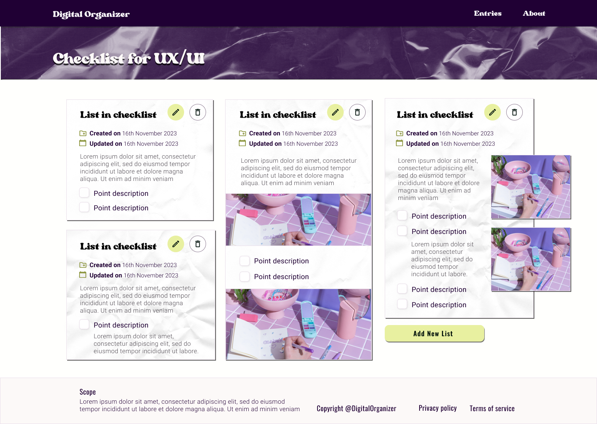
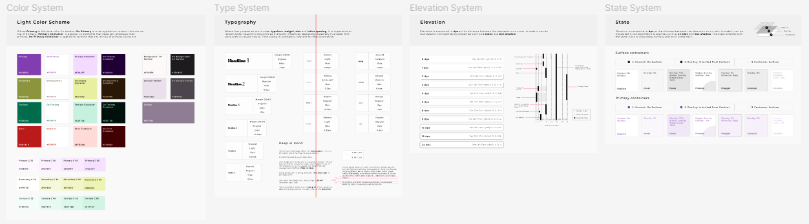
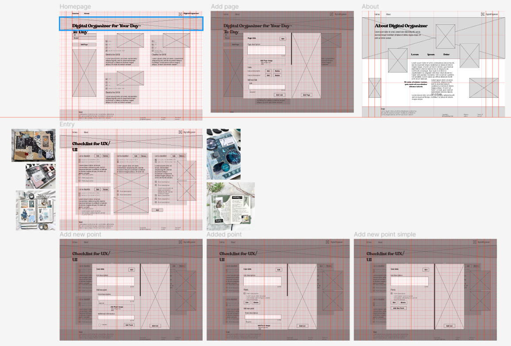
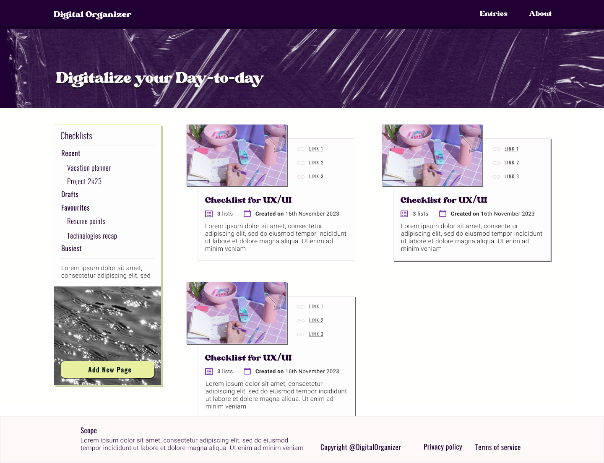
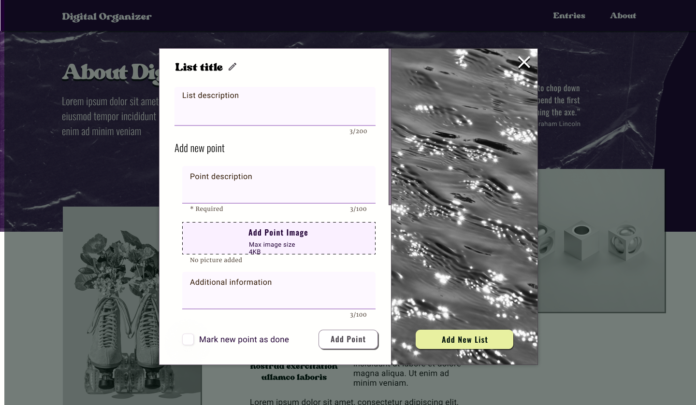

### Technical considerations

Digital Organizer Tool made with:

- React 18.2.0
- Firebase SDK v9
- SASS 1.57.1

Firebase SDK for [database](https://firebase.google.com/docs/database/web/start) and [cloud storage](https://firebase.google.com/docs/storage/web/start) is linked with a React based UI.

Information organization:

The tool has points, lists and pages that respect the relation: Point ⊂ List ⊂ Page.

Folder structure includes:

The `services/database` and `services/fileStorage` functions for CRUD with a `firebase.ts` config file.

The `router.tsx` with routes for the `<MainPage />` (`/`) and `<DetailsPage />` (`/page/:pageId`). The `loaders` folder holds functions for loading the results for pages and lists.

`<MainPage />` is filtering between `<AllView />` and `<RecentView />`.

The `<DetailsPage />` contains the `<DetailsView />` with the ability to add (`<AddView />`) or edit (`<EditView />`) the list page.

The `testData.json` holds an example of how data presents itself in the database. Properties explanation:

- a page has references to the lists it contains through `keysLists`
- a page has `links` to store sources for the information
- a list has `points` for list items

### Design considerations

In order for the project to come to fruition I have used both a **moodboard** and a **style guide** to develop my Y2K vision.
Afterwards, I have integrated some primitives for colour, as well as for buttons and inputs, which have served as the go-to standard for each item that required their functions.

With the primites done, I have crafted the wireframes. I care to mention, the whole process was done using Figma.

In the end, combining all the design deliverables has resulted in a simple yet cohesive design.

The sitemap contains a `/homepage`, an `/about` page and a `/details/id` page, complemented by a modal for CRUD operations.

